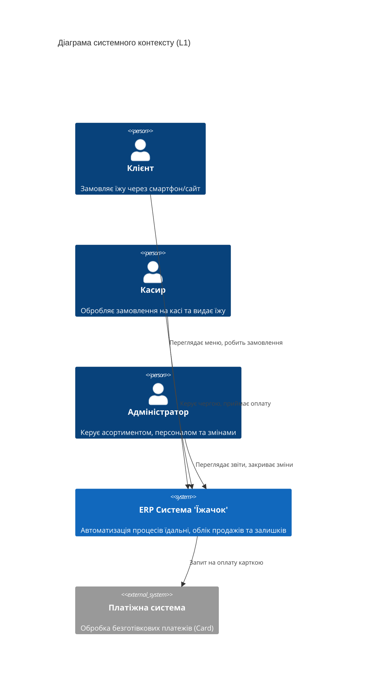
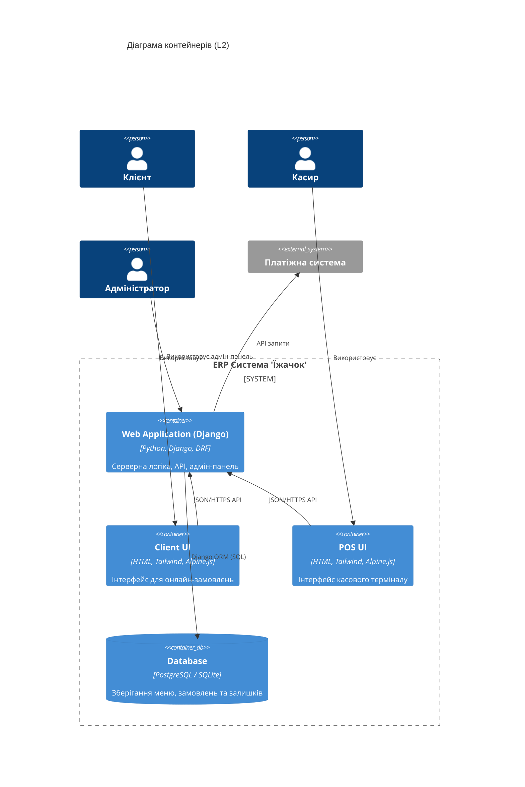
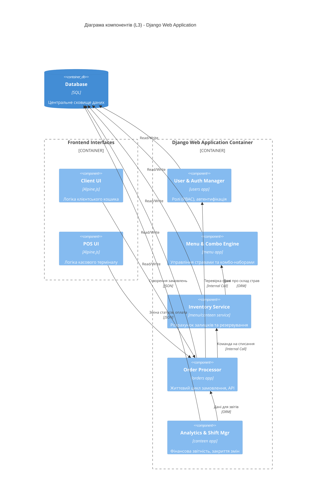

# Архітектурні діаграми системи "Їжачок" (C4 Model)

Цей файл містить код для візуалізації архітектури за допомогою інструменту Mermaid.
Ви можете скопіювати код нижче та вставити його в [Mermaid Live Editor](https://mermaid.live/).

---

## Рівень 1: Діаграма системного контексту (L1 - System Context)
Ця діаграма показує взаємодію системи із зовнішніми акторами та системами.

---

## Рівень 2: Діаграма контейнерів (L2 - Containers)
Показує основні програмні блоки системи та технології.

---

## Рівень 3: Діаграма компонентів (L3 - Components)
Показує внутрішню структуру основного Django-додатка.

